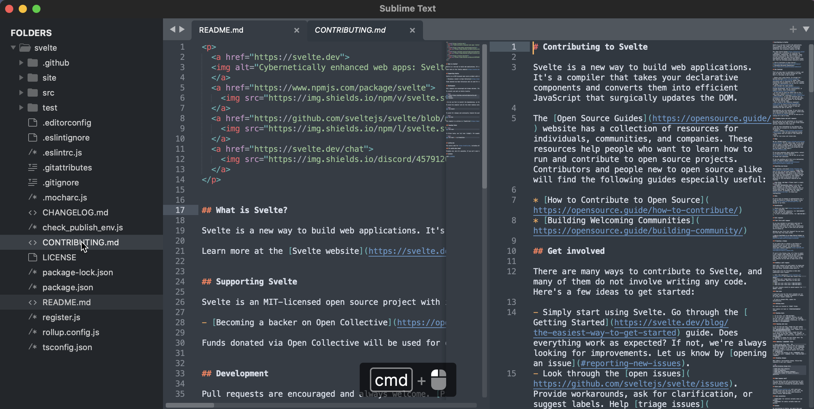

# Sublime text

[Sublime Text](https://www.notion.so/desktop) is a shareware cross-platform source code editor. It natively supports many programming languages and markup languages. 

You can expand its functionality with plugins, typically community-built and maintained under free-software licenses.

## How to install

*From site*

[sublimetext.com](https://www.sublimetext.com)
