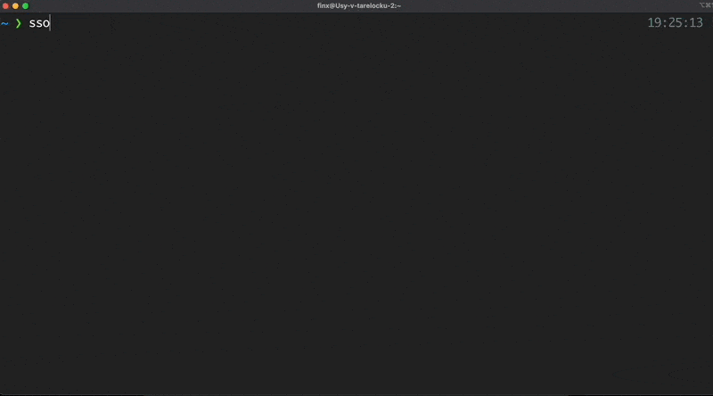
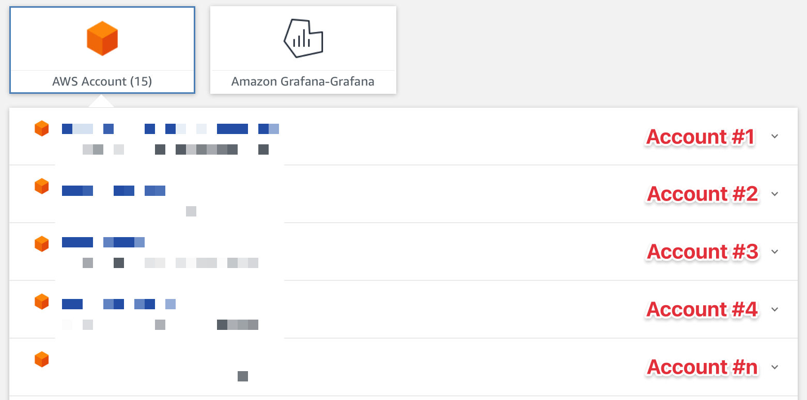
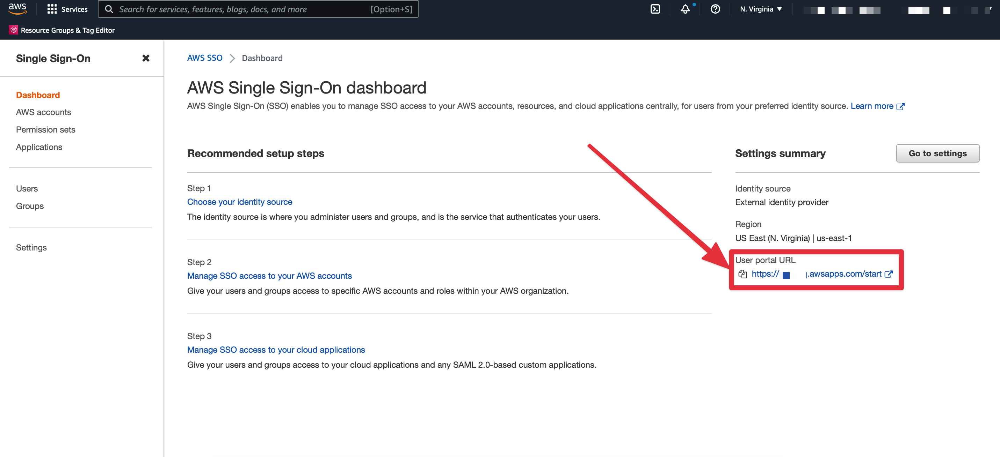
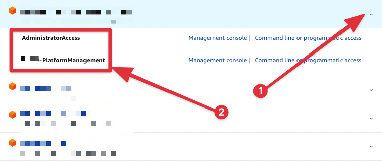

# aws-sso-util



[AWS SSO util](https://github.com/benkehoe/aws-sso-util) is a tool helps you get temporary AWS credentials for all accounts in one fell swoop from AWS SSO.

When companies grow, they increase the number of employees, projects, AWS accounts. Sooner or later, they think about how to correctly and easily provide access to their AWS accounts for all team. One option is to use AWS SSO.



If you want to get an access to the AWS you need to get temporary credentials from the AWS SSO, and update your `~/.aws/credentials`. But what I will tell you is that these credentials are TEMPORARY and you need to copy/paste them for all necessary account a lot of time during the day. capp huh?

What If I say that you can get temporary credentials for all account for 8 hours just using 1 command? magic? :) 

## How to install

*Pip*

```shell
pip3 install aws-sso-util
```

*From source*

You can also install this tool manually from the [GitHub](https://github.com/benkehoe/aws-sso-util/releases)

## How to configure

1. Open `~/.aws/credentials` file

2. Remove previous manually copied credentials

3. Open `~/.aws/config` file

4. Remove previous manually copied profiles

5. Add new profiles

```shell
[profile <Name>]
region = <Region>
output = json
sso_start_url = <SSO URL>
sso_region = <Region where is SSO was configured>
sso_account_id = <Account ID>
sso_role_name = <SSO Role name>
```

Example:

```shell
[profile 124295726813_BOOK-PlatformManagement]
region = us-east-1
output = json
sso_start_url = https://book.awsapps.com/start
sso_region = us-east-1
sso_account_id = 124295726813
sso_role_name = BOOK-PlatformManagement

[profile 683725964332_BOOK-PlatformManagement]
region = eu-central-1
output = json
sso_start_url = https://book.awsapps.com/start
sso_region = us-east-1
sso_account_id = 683725964332
sso_role_name = BOOK-PlatformManagement

...
```

- `sso_start_url` You can check in the [AWS SSO](https://us-east-1.console.aws.amazon.com/singlesignon/identity/home) page 



- `sso_role_name` Expand the account and look at the role name



## How to use

I would create an alias for ease of use.

```shell
alias sso='aws-sso-util login'
```

1. Run `sso` in your terminal

2. It will open a new page in the browser

3. If you have already logged in to the AWS SSO - you will need just approve the request. Or you need to enter the AWS SSO first and then approve the request.

4. Profit
