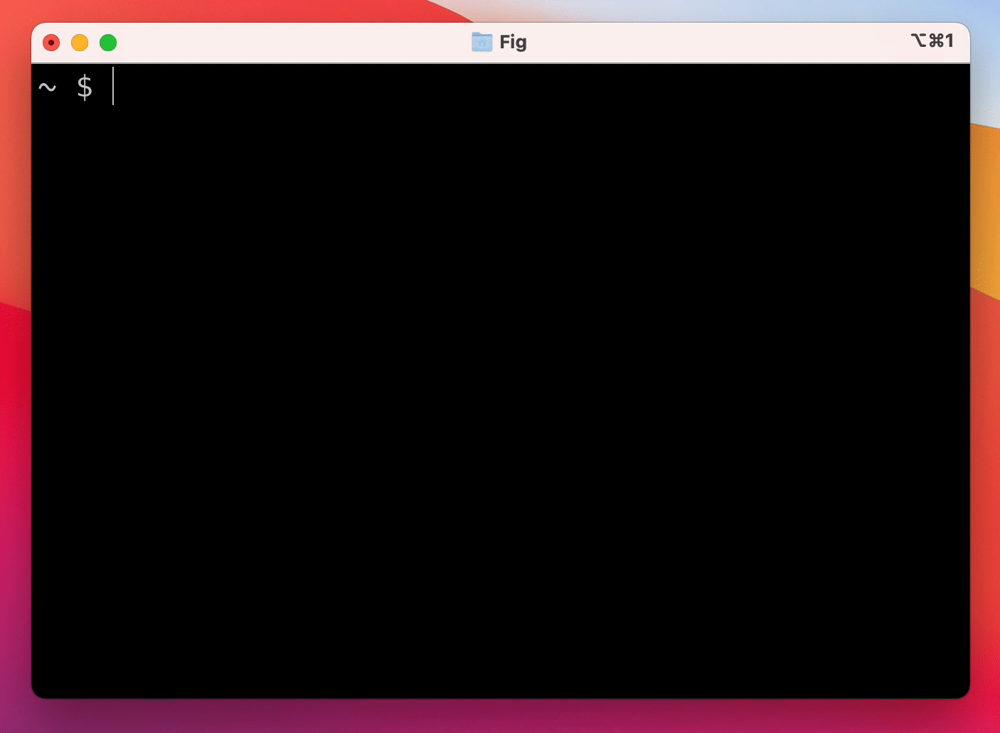

# Fig



[Fig](https://github.com/withfig/autocomplete) adds autocomplete to your terminal.

As you type, Fig pops up subcommands, options, and contextually relevant arguments in your existing terminal on macOS.

## How to install

*Brew*

```shell
brew install --cask fig
```

*From site*

[https://fig.io](https://fig.io)

## How to use


