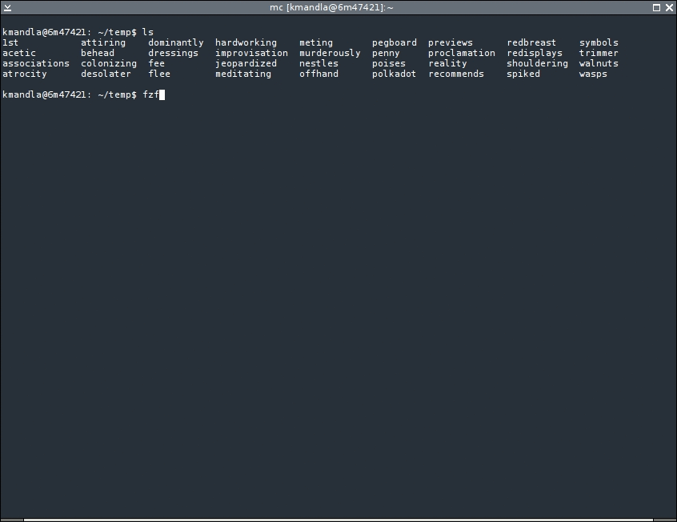

# FZF



[fzf](https://github.com/junegunn/fzf) is a general-purpose command-line fuzzy finder.

It's an interactive Unix filter for command-line that can be used with any list; files, command history, processes, hostnames, bookmarks, git commits, etc.

## How to install

*Brew*

```shell
brew install fzf

# To install useful key bindings and fuzzy completion:
$(brew --prefix)/opt/fzf/install
```

*Git*

Alternatively, you can "git clone" this repository to any directory and run install script.

```shell
git clone --depth 1 https://github.com/junegunn/fzf.git ~/.fzf
~/.fzf/install
```

## How to usage

fzf will launch interactive finder, read the list from STDIN, and write the selected item to STDOUT.

```shell
find * -type f | fzf > selected
```

## Demo 

<a title="fzf - command-line fuzzy finder" href="https://www.youtube.com/watch?v=qgG5Jhi_Els">
  
</a>

