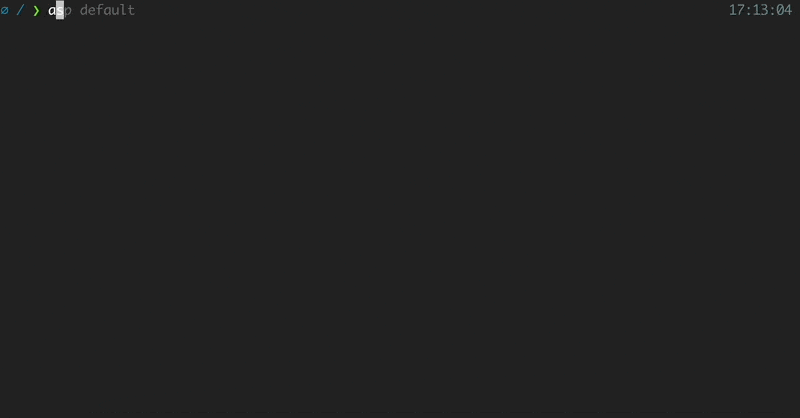
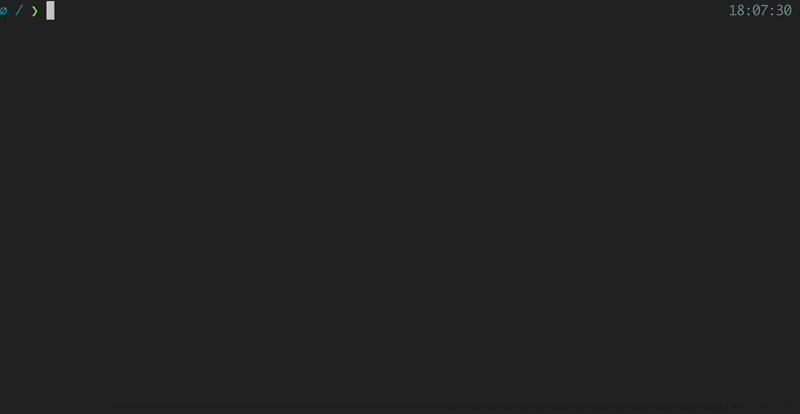
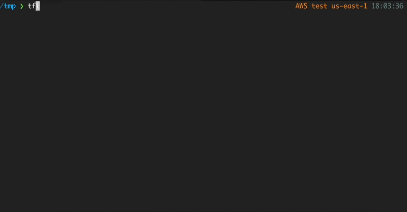
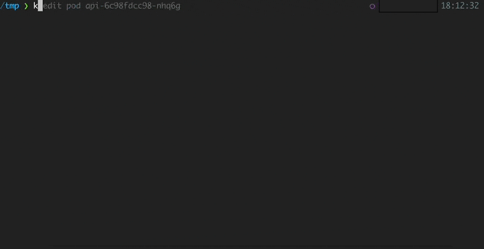

# Oh My Zsh Plugins


[Oh My Zsh](https://ohmyz.sh/) comes bundled with plugins, which allow you to take advantage of functionality of many sorts to your shell just by enabling them.

There are a list of plugins that we use:

- [git](#git)
- [aws](#aws)
- [zsh-autosuggestions](#zsh-autosuggestions)
- [zsh-syntax-highlighting](#zsh-syntax-highlighting)
- [terraform](#terraform)
- [kubectl](#kubectl)
- [helm](#helm)
- [colored-man-pages](#colored-man-pages)

## How to install

Enable a plugin by adding its name to the `plugins` array in your `.zshrc` file.

### Git


The git plugin provides many [aliases](https://github.com/ohmyzsh/ohmyzsh/blob/master/plugins/git/README.md#aliases) and a few useful [functions](https://github.com/ohmyzsh/ohmyzsh/blob/master/plugins/git/README.md#functions).

To use it, add `git` to the plugins array in your zshrc file:

```shell
plugins=(... git)
```

[More about plugin](https://github.com/ohmyzsh/ohmyzsh/blob/master/plugins/git)

### AWS



This plugin provides completion support for [awscli](https://docs.aws.amazon.com/cli/latest/reference/index.html)
and a few utilities to manage AWS profiles and display them in the prompt.

To use it, add `aws` to the plugins array in your zshrc file.

```shell
plugins=(... aws)
```

[More about plugin](https://github.com/ohmyzsh/ohmyzsh/blob/master/plugins/aws)

### Zsh-autosuggestions


1. Clone this repository into $ZSH_CUSTOM/plugins (by default ~/.oh-my-zsh/custom/plugins)

```shell
git clone https://github.com/zsh-users/zsh-autosuggestions ${ZSH_CUSTOM:-~/.oh-my-zsh/custom}/plugins/zsh-autosuggestions
```

2. Add the plugin to the list of plugins for Oh My Zsh to load (inside ~/.zshrc):

```shell
plugins=(... zsh-autosuggestions)
```

3. Start a new terminal session.

[More about plugin](https://github.com/zsh-users/zsh-autosuggestions)

### Zsh-syntax-highlighting



1. Clone this repository in oh-my-zsh's plugins directory:

```shell
git clone https://github.com/zsh-users/zsh-syntax-highlighting.git ${ZSH_CUSTOM:-~/.oh-my-zsh/custom}/plugins/zsh-syntax-highlighting
```

2.Activate the plugin in ~/.zshrc:

```shell
plugins=(... zsh-syntax-highlighting)
```

3. Start a new terminal session.

[More about plugin](https://github.com/zsh-users/zsh-syntax-highlighting)

### Terraform



Plugin for Terraform, a tool from Hashicorp for managing infrastructure safely and efficiently.
It adds completion for `terraform`, as well as aliases and a prompt function.

To use it, add `terraform` to the plugins array of your `~/.zshrc` file:

```shell
plugins=(... terraform)
```

[More about plugin](https://github.com/ohmyzsh/ohmyzsh/blob/master/plugins/terraform)

### Kubectl



This plugin adds completion for the [Kubernetes cluster manager](https://kubernetes.io/docs/reference/kubectl/kubectl/),
as well as some aliases for common kubectl commands.

To use it, add `kubectl` to the plugins array in your zshrc file:

```shell
plugins=(... kubectl)
```

[More about plugin](https://github.com/ohmyzsh/ohmyzsh/blob/master/plugins/kubectl)

### Colored-man-pages


This plugin adds colors to man pages.

To use it, add `colored-man-pages` to the plugins array in your zshrc file:

```shell
plugins=(... colored-man-pages)
```

It will also automatically colorize man pages displayed by `dman` or `debman`,
from [`debian-goodies`](https://packages.debian.org/stable/debian-goodies).

You can also try to color other pages by prefixing the respective command with `colored`:

```shell
colored git help clone
```

[More about plugin](https://github.com/ohmyzsh/ohmyzsh/blob/master/plugins/colored-man-pages)

---

More plugins you can find in the [official](https://github.com/ohmyzsh/ohmyzsh/wiki/Plugins) GitHub page.
