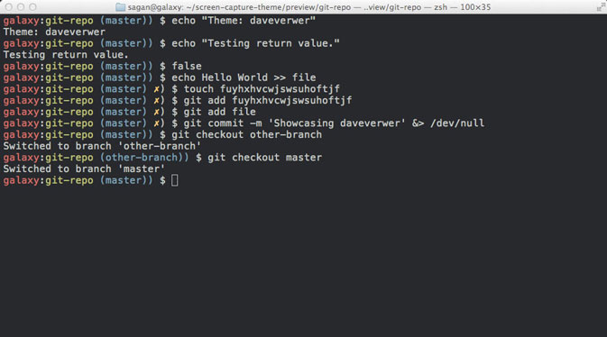
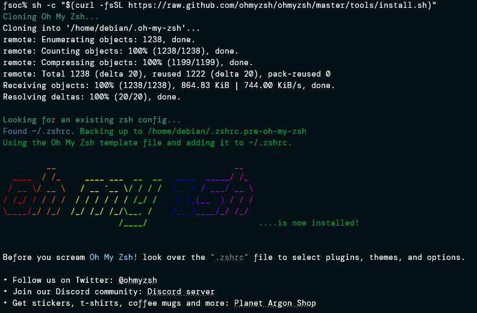
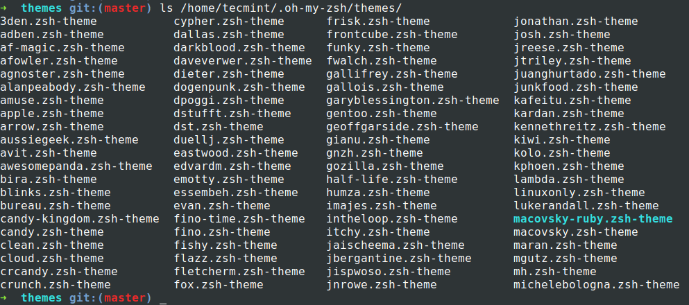
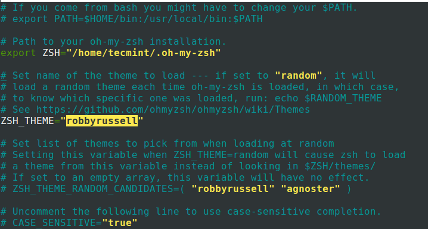
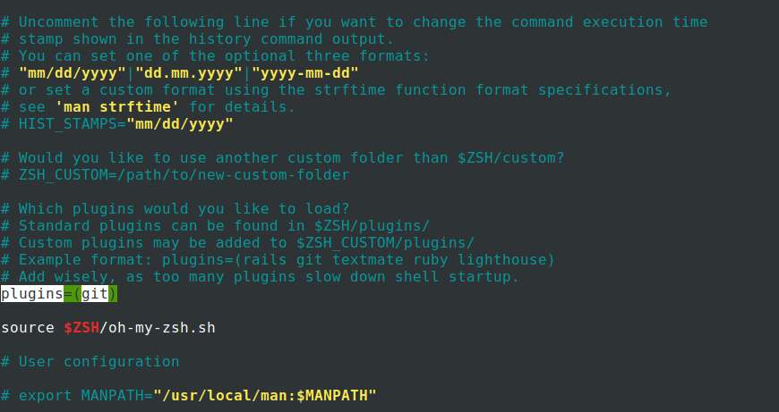
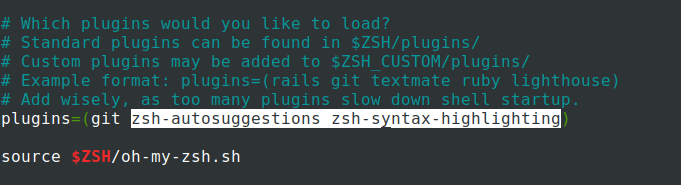

# Oh My Zsh



[Oh-my-zsh](https://ohmyz.sh/) is used to help efficiently manage and configure the ZSH shell. It comes packed with functions, themes, and plugins to improve the default ZSH shell. Although other ZSH frameworks help manage the ZSH configuration, oh-my-zsh is the most popular and easy to configure.

## How to install

*Linux*

```shell
sh -c "$(curl -fsSL https://raw.github.com/ohmyzsh/ohmyzsh/master/tools/install.sh)"
```



## Themes

Among all features in OH-MY-ZSH, I love the set of themes that comes in a bundle with the installation. It visually improves my terminal look and feel. Themes are installed under `/home/<user>/.oh-my-zsh/themes/`.

```shell
$ ls /home/tecmint/.oh-my-zsh/themes/
```



By default `robbyrussell` is the theme that gets loaded. To change the theme modify the parameter `ZSH_THEME=<THEME-NAME>` under the `.zshrc` file.

```shell
vi nano ~/.zshrc
```



You have to source (`source ~/.zshrc`) the file for changes to be effective.

```shell
$ source ~/.zshrc
```

## Plugins

There are tons of plugins that are supported by `OH-MY-ZSH`. Setting up a plugin is quite easy. All you have to do is [get the plugin package](https://github.com/ohmyzsh/ohmyzsh/tree/master/plugins) and add the plugin name in the plugins parameter on the `.zshrc` file. By default, git is the only plugin that is enabled after installation.



Now I will add two more plugins `ZSH-autosuggestions and ZSH-Syntax-highlighting` by cloning the packages.

```shell
$ git clone https://github.com/zsh-users/zsh-autosuggestions.git $ZSH_CUSTOM/plugins/zsh-autosuggestions
$ git clone https://github.com/zsh-users/zsh-syntax-highlighting.git $ZSH_CUSTOM/plugins/zsh-syntax-highlighting
```

To make plugins effective all you have to do is edit the `.zhsrc` file, add the plugin name in `plugins=()` with a space between each plugin name.

```shell
$ vim ~/.zshrc
```



Now source (`source ~/.zshrc`) file for changes to be effective. Now you can see from the screenshot the `auto-suggestion` feature is enabled and it remembers the command I used previously and suggests based on it.

## Useful articles

- [Installing OH-MY-ZSH in Ubuntu Linux](https://www.tecmint.com/install-oh-my-zsh-in-ubuntu/)

- [Oh My Zsh + PowerLevel10k = 😎 terminal](https://dev.to/abdfnx/oh-my-zsh-powerlevel10k-cool-terminal-1no0)