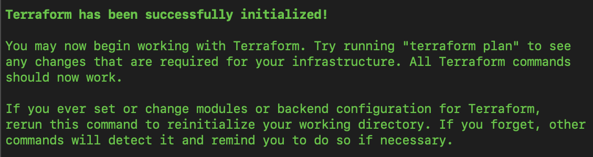

# aws-sso-cred-restore

  

[AWS SSO cred restore](https://package.wiki/aws-sso-cred-restore) is a simple script to make it easier to use AWS Single Sign On credentials with tools that don't understand the sso entries in an AWS profile.

Let's imagine:

1. You work with Terraform. 

2. Your company uses AWS SSO, and you use [aws-sso-util](../aws-sso) to easily get temporary credentials for all accounts.

3. Your terraform modules located in the *private s3 bucket*

4. You make `terraform init` and got Error `Failed to download module`

  

It means that terraform trying to find `aws_access_key_id` and `aws_secret_access_key` in the `~/.aws/credentials` file based on your profile but can't due to [aws-sso-util](../aws-sso) won't add these credentials to this file.

You can use `aws-sso-cred-restore` to solve this problem. It will get temporary credentials and set them to `~/.aws/credentials`

  

## How to install

*Pip*

```shell
pip3 install aws-sso-cred-restore
```

*From source*

You can also install this tool manually from the [GitHub](https://github.com/claytonsilva/aws-sso-cred-restore/releases)

## How to use

1. Connect to the SSO through [aws-sso-util](../aws-sso)

2. Set right AWS profile for your terraform where your private modules located through [asp](SET-PATH-IN-FUTURE-TO-THE-PLUGIN)

```shell
asp 124295726813_BOOK-PlatformManagement
```

3. Run `aws-sso-cred-restore`

```shell
aws-sso-cred-restore --profile 124295726813_BOOK-PlatformManagement
```

*NOTE:* If you open the `~/.aws/credentials` file, you will find the exported credentials.

```shell
[124295726813_BOOK-PlatformManagement]
aws_access_key_id = ABSDF2A34ESVEJSRU
aws_secret_access_key = JX/+iQqwquIhjwZ9ADi6rW9w2PqOTV864VQChzvR
aws_session_token = IQoJb3JpZ2luX2VjEPf//////////wEaCXVzLWVhc3QtMSJHMEUCIQDa...
```

4. Run `terraform init`