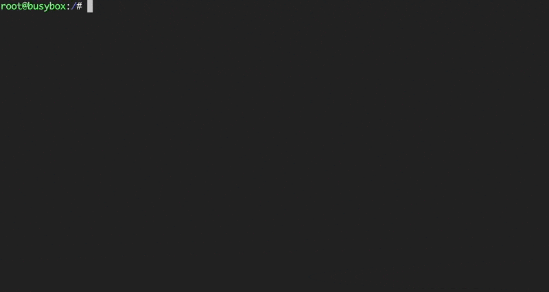
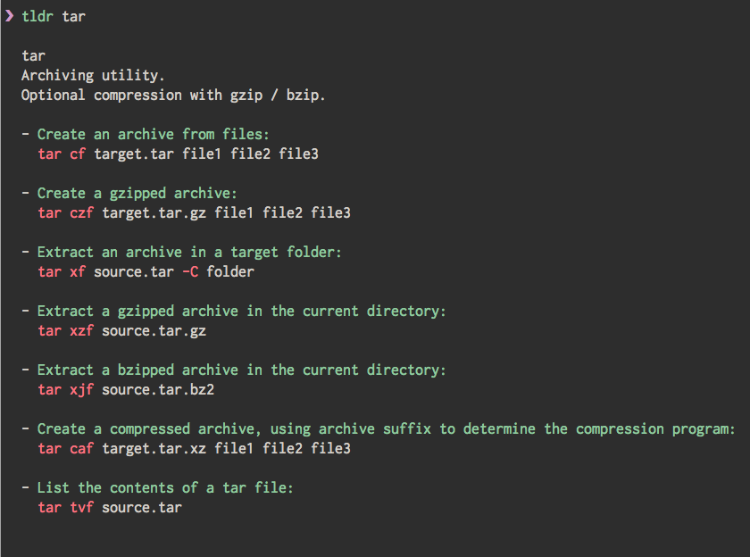

# TLDR pages



[TLDR](https://tldr.sh/) is a simplified and community-driven man pages

The tldr pages are a community effort to simplify the beloved man pages with practical examples.

## How to install

*NPM*

```shell
npm install -g tldr
```

## How to use


