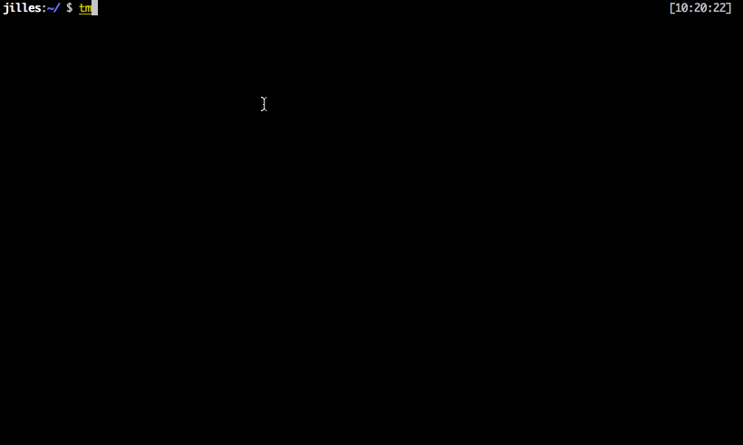

# Tmux



[Tmux](https://github.com/tmux/tmux) is a terminal multiplexer: it enables a number of terminals to be created, accessed, and controlled from a single screen. tmux may be detached from a screen and continue running in the background, then later reattached.

## How to install

*Brew*

```shell
brew install tmux
```

*Linux*

```shell
apt install tmux
```

*From source*

You can also install this tool manually from the [GitHub](https://github.com/tmux/tmux/releases)


## How to use

### Creating Named Tmux Sessions

By default, Tmux sessions are named numerically. Named sessions are useful when you run multiple Tmux sessions. To create a new named session, run the tmux command with the following arguments:

```shell
tmux new -s session_name
```

### Detaching from Tmux Session

You can detach from the Tmux session and return to your normal shell by typing:

```shell
Ctrl+b d
```

### Re-attaching to Tmux Session

To attach to a session first, you need to find the name of the session. To get a list of the currently running sessions type:

```shell
tmux ls
```

For example, to attach to session 0, you would type:

```shell
tmux attach-session -t 0
```

### Commands

`Ctrl+b c` Create a new window (with shell)
`Ctrl+b w` Choose window from a list
`Ctrl+b 0` Switch to window 0 (by number )
`Ctrl+b ,` Rename the current window
`Ctrl+b %` Split current pane horizontally into two panes
`Ctrl+b "` Split current pane vertically into two panes
`Ctrl+b o` Go to the next pane
`Ctrl+b ;` Toggle between the current and previous pane
`Ctrl+b x` Close the current pane
