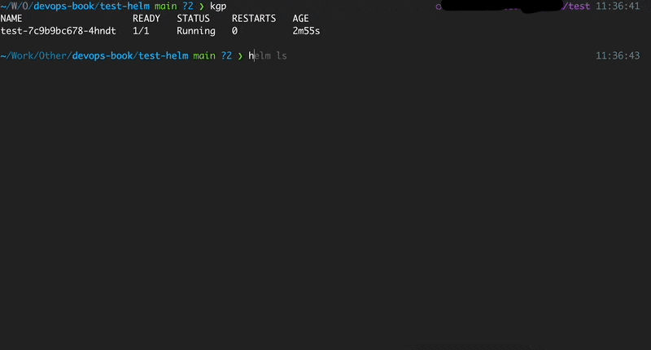

# helm diff



[Helm diff](https://github.com/databus23/helm-diff) is a helm plugin that shows a diff explaining what a helm upgrade would change.

It works the same way when you make a "terraform plan". You see the changes and then, if everything is ok, you apply the changes.

This is so useful because there must be a situation where you accidentally delete a very important resource and everything stops working in production.

## How to install

*Helm*

```shell
helm plugin install https://github.com/databus23/helm-diff
```

*From source*

You can also install this tool manually from the [GitHub](https://github.com/databus23/helm-diff/releases)

## How to use

```shell
The Helm Diff Plugin

* Shows a diff explaining what a helm upgrade would change:
    This fetches the currently deployed version of a release
  and compares it to a local chart plus values. This can be 
  used visualize what changes a helm upgrade will perform.

* Shows a diff explaining what had changed between two revisions:
    This fetches previously deployed versions of a release
  and compares them. This can be used visualize what changes 
  were made during revision change.

* Shows a diff explaining what a helm rollback would change:
    This fetches the currently deployed version of a release
  and compares it to the previously deployed version of the release, that you
  want to rollback. This can be used visualize what changes a 
  helm rollback will perform.

Usage:
  diff [flags]
  diff [command]

Available Commands:
  release     Shows diff between release's manifests
  revision    Shows diff between revision's manifests
  rollback    Show a diff explaining what a helm rollback could perform
  upgrade     Show a diff explaining what a helm upgrade would change.
  version     Show version of the helm diff plugin

Flags:
      --allow-unreleased             enables diffing of releases that are not yet deployed via Helm
  -a, --api-versions stringArray     Kubernetes api versions used for Capabilities.APIVersions
      --color                        color output. You can control the value for this flag via HELM_DIFF_COLOR=[true|false]. If both --no-color and --color are unspecified, coloring enabled only when the stdout is a term and TERM is not "dumb"
  -C, --context int                  output NUM lines of context around changes (default -1)
      --detailed-exitcode            return a non-zero exit code when there are changes
      --devel                        use development versions, too. Equivalent to version '>0.0.0-0'. If --version is set, this is ignored.
      --disable-openapi-validation   disables rendered templates validation against the Kubernetes OpenAPI Schema
      --disable-validation           disables rendered templates validation against the Kubernetes cluster you are currently pointing to. This is the same validation performed on an install
      --dry-run                      disables cluster access and show diff as if it was install. Implies --install, --reset-values, and --disable-validation
  -h, --help                         help for diff
      --include-tests                enable the diffing of the helm test hooks
      --install                      enables diffing of releases that are not yet deployed via Helm (equivalent to --allow-unreleased, added to match "helm upgrade --install" command
      --kube-version string          Kubernetes version used for Capabilities.KubeVersion
      --kubeconfig string            This flag is ignored, to allow passing of this top level flag to helm
      --no-color                     remove colors from the output. If both --no-color and --color are unspecified, coloring enabled only when the stdout is a term and TERM is not "dumb"
      --no-hooks                     disable diffing of hooks
      --normalize-manifests          normalize manifests before running diff to exclude style differences from the output
      --output string                Possible values: diff, simple, json, template. When set to "template", use the env var HELM_DIFF_TPL to specify the template. (default "diff")
      --post-renderer string         the path to an executable to be used for post rendering. If it exists in $PATH, the binary will be used, otherwise it will try to look for the executable at the given path
      --repo string                  specify the chart repository url to locate the requested chart
      --reset-values                 reset the values to the ones built into the chart and merge in any new values
      --reuse-values                 reuse the last release's values and merge in any new values. If '--reset-values' is specified, this is ignored
      --set stringArray              set values on the command line (can specify multiple or separate values with commas: key1=val1,key2=val2)
      --set-file stringArray         set values from respective files specified via the command line (can specify multiple or separate values with commas: key1=path1,key2=path2)
      --set-string stringArray       set STRING values on the command line (can specify multiple or separate values with commas: key1=val1,key2=val2)
      --show-secrets                 do not redact secret values in the output
      --strip-trailing-cr            strip trailing carriage return on input
      --suppress stringArray         allows suppression of the values listed in the diff output
  -q, --suppress-secrets             suppress secrets in the output
      --three-way-merge              use three-way-merge to compute patch and generate diff output
  -f, --values valueFiles            specify values in a YAML file (can specify multiple) (default [])
      --version string               specify the exact chart version to use. If this is not specified, the latest version is used

Additional help topics:
  diff          

Use "diff [command] --help" for more information about a command.
```