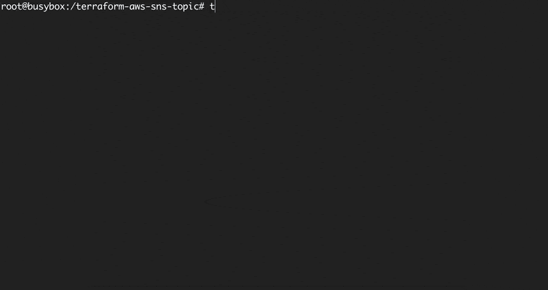

# Terraform docs



[Terraform docs](https://github.com/terraform-docs/terraform-docs) is utility to generate documentation from Terraform modules in various output formats.

This tool generate documentation based on `variables.tf`, `outputs.tf` and provider information. 
Therefore, please fill in the values of the variables "description", "type" and "default" completely.

## How to install

*Brew*

```shell
brew install terraform-docs
```

*Linux*

```shell
curl -Lo ./terraform-docs.tar.gz https://github.com/terraform-docs/terraform-docs/releases/download/v0.16.0/terraform-docs-v0.16.0-$(uname)-amd64.tar.gz
tar -xzf terraform-docs.tar.gz
chmod +x terraform-docs
mv terraform-docs /usr/local/bin/terraform-docs
```

*From source*

You can also install this tool manually from the [GitHub](https://github.com/terraform-docs/terraform-docs/releases)

## How to use

To run and generate documentation into README within a directory:

```shell
terraform-docs markdown table --output-file README.md --output-mode inject /path/to/module
```

Check [`output`] configuration for more details and examples.

To run and generate documentation into console with sort

```shell
terraform-docs markdown . --sort=true --sort-by required
```