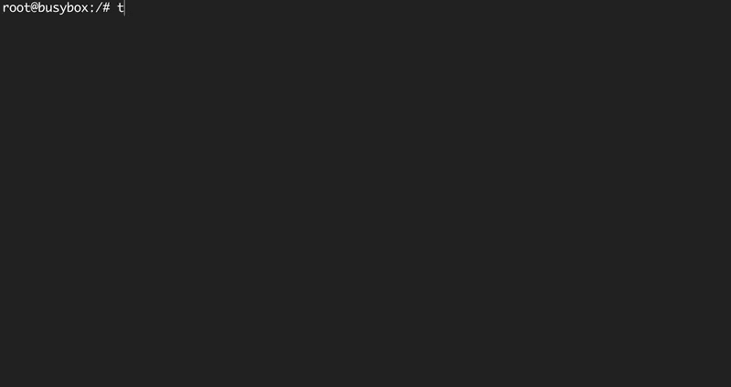

# TFswitch



The [tfswitch](https://tfswitch.warrensbox.com) command line tool lets you switch between different versions of terraform.

It is so useful when you are working on different projects and need to switch between different terraform versions.

Now you forget about downloading/updating terraform versions manually.

## How to install

*Brew*

```shell
brew install warrensbox/tap/tfswitch
```

*Linux*

```shell
curl -L https://raw.githubusercontent.com/warrensbox/terraform-switcher/release/install.sh | bash
```

*From source*

You can also install this tool manually from the [GitHub](https://github.com/warrensbox/terraform-switcher/releases)

## How to use

Use dropdown menu to select version


1. You can switch between different versions of terraform by typing the command tfswitch on your terminal.

2. Select the version of terraform you require by using the up and down arrow.

3. Hit Enter to select the desired version.

Supply version on command line


1. You can also supply the desired version as an argument on the command line.

2. For example, tfswitch 0.10.5 for version 0.10.5 of terraform.

3. Hit Enter to switch.

See all versions including beta, alpha and release candidates


1. Display all versions including beta, alpha and release candidates(rc).

2. For example, tfswitch -l or tfswitch --list-all to see all versions.

3. Hit Enter to select the desired version.